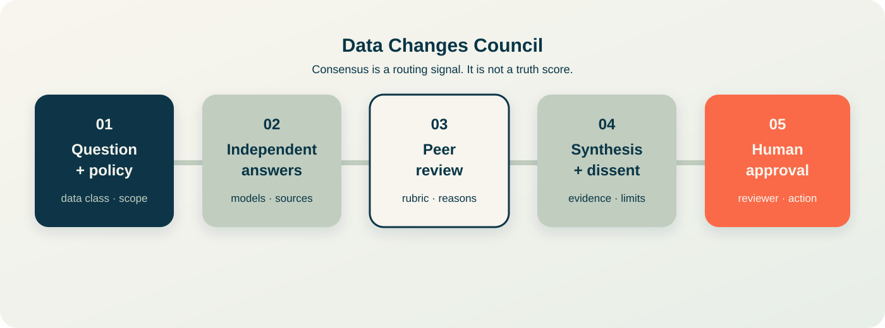
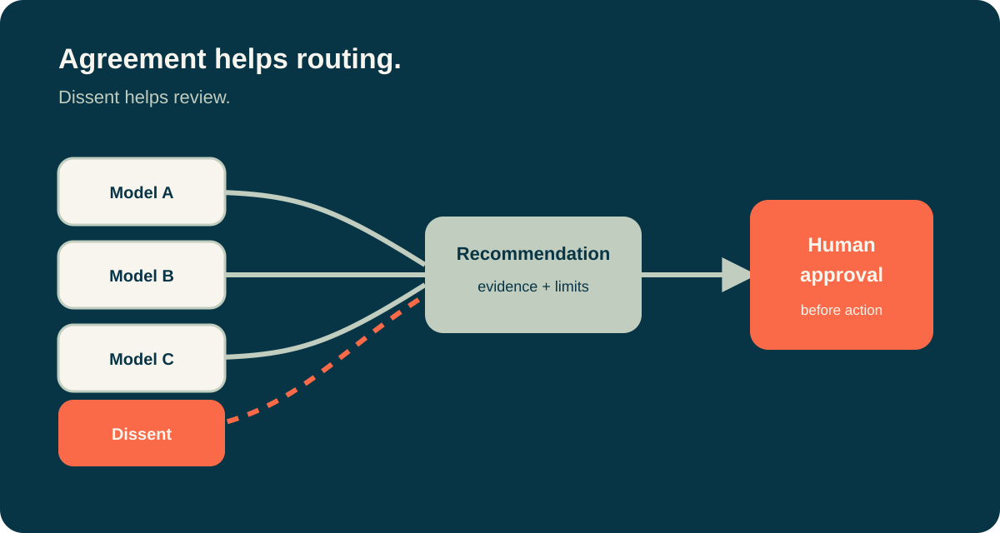

# Data Changes Council


**A practical council for comparing AI answers before people act on them.**

Data Changes Council sends a task to several language models, keeps their first answers independent, asks them to review a structured rubric, and returns a synthesis with disagreement visible. A person remains responsible for the decision.

This project is designed for teams that want to use multiple LLMs without hiding uncertainty behind a single confident answer.

## Why Data Changes Council

A single model can miss a constraint, rely on a weak assumption, or sound certain when the evidence is thin. A council can expose differences in reasoning. It does not make a wrong source correct, and agreement is not proof.

Data Changes Council therefore treats these as first-class output:

- independent answers and their sources;
- rubric scores with the reason for each score;
- dissent and unresolved questions;
- estimated cost and latency;
- a human approval state before any external action.

## Current state

The repository is an early TypeScript foundation. The deliberation engine currently contains routing and result types, while provider calls and the full review pipeline are being built in small, inspectable steps.

The first release will focus on decision support. It will not execute emails, code changes, purchases, or other external actions automatically.

## Planned workflow

```text
question and context
        |
        v
policy and data checks
        |
        v
independent model responses
        |
        v
structured peer review
        |
        v
synthesis with consensus and dissent
        |
        v
human approval or escalation
```

## Planned improvements over a basic LLM council

1. **Evidence first**: attach source references and mark claims that still need checking.
2. **Useful disagreement**: preserve dissent instead of reducing every vote to a percentage.
3. **Risk based routing**: use a small council for simple tasks and escalate only when ambiguity or impact warrants it.
4. **Governance gates**: classify input data, restrict tools, log decisions, and require approval for high impact actions.
5. **Provider portability**: use adapters so one provider outage does not stop the whole council.
6. **Reproducible sessions**: store model versions, prompts, rubric versions, timestamps, and costs.
7. **Evaluation before confidence**: measure council performance on a task set instead of treating agreement as accuracy.
8. **Dutch and English support**: keep the decision record readable for the people who own the work.

See [ROADMAP.md](ROADMAP.md) for the implementation sequence and [GOVERNANCE.md](GOVERNANCE.md) for the safety boundaries.

## A session at a glance



The council keeps the useful disagreement visible until a person has enough context to approve, revise, or stop the recommendation.



## Install with the CLI

Use the CLI when you want reproducible setup, branches, commits, and scripted deployments.

```bash
git clone https://github.com/anouar-zh/data-changes-council.git
cd data-changes-council
npm install
npm run build
```

Copy `.env.example` to `.env` and add only the provider keys you need. Keep `.env` local and never commit API keys.

Start the development server with:

```bash
npm run dev:server
```

## Install with GitHub Desktop

Use GitHub Desktop if you prefer a visual workflow.

1. Open GitHub Desktop and sign in to `anouar-zh`.
2. Choose **File → Clone repository → URL**.
3. Enter `https://github.com/anouar-zh/data-changes-council.git`.
4. Choose a local folder and click **Clone**.
5. Open the folder in your editor.
6. Run `npm install` and `npm run build` in the editor terminal.
7. Make changes in a branch, review the diff in GitHub Desktop, then commit and push.

GitHub Desktop handles cloning and commits. Node.js and npm are still required to install and run the TypeScript project.

## Quick start

```bash
npm install
npm run build
```

Copy `.env.example` to `.env` and add only the provider keys you need. Never commit `.env` or API keys.

## Project origin and license

Data Changes Council is a modified fork of [OliWoods-Org/llm-council](https://github.com/OliWoods-Org/llm-council). The upstream repository is licensed under Apache 2.0. See [ORIGIN.md](ORIGIN.md) and [LICENSE](LICENSE) for attribution and license terms.

Data Changes Council is an independent project by Anouar Znagui Hassani / Data Changes. It is not affiliated with or endorsed by the upstream project or any model provider.
