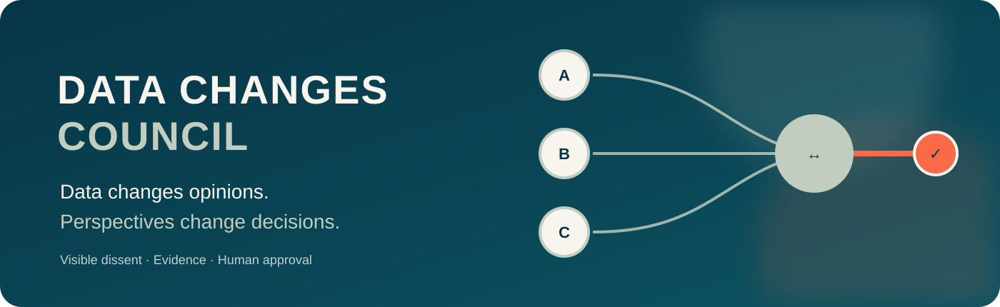

# Data Changes Council



**Data changes opinions. Perspectives change decisions.**

Data Changes Council is a small, reusable skill for decisions that deserve more than one AI perspective. It separates proposal, challenge, evidence checking, and operational reality instead of treating model agreement as proof.

There is no application to install and no API key to configure. The main file is the skill itself: [SKILL.md](SKILL.md).

## What it helps with

- comparing several AI answers before acting;
- routing review depth by impact and reversibility;
- spotting shared assumptions, weak sources, and prompt injection;
- testing a minority view instead of hiding it;
- turning disagreement into a decision record someone else can inspect;
- keeping ownership, action boundaries, and human approval clear.

## Why use it instead of a basic model council?

The skill changes the decision process:

- it uses the smallest sufficient council instead of a fixed model count;
- it keeps a claim ledger instead of a vague confidence score;
- it treats consensus as a routing signal, not proof;
- it gives dissent a reason, a challenge, and a status;
- it stops when evidence, ownership, or data boundaries are missing;
- it ends with the smallest safe test a team can actually run;
- it records outcomes so the process can be calibrated over time;
- it distinguishes exploratory, proposed, approved, blocked, and closed decisions;
- it compares options qualitatively without inventing precise scores.

## Install or use it

This repository contains an Agent Skills compatible instruction file. It is not a Python package, MCP server, model, or application. It does not install an API key. The same `SKILL.md` can be used by Codex, ChatGPT Skills, and Claude Code. ChatGPT Projects and Claude Projects can also use it as uploaded context.

### Codex CLI or Codex app

For a project-local Codex skill, run these commands from the repository where you use Codex:

```bash
mkdir -p .agents/skills/data-changes-council
git clone https://github.com/anouar-zh/data-changes-council.git /tmp/data-changes-council
cp /tmp/data-changes-council/SKILL.md .agents/skills/data-changes-council/SKILL.md
```

The resulting layout must be:

```text
your-project/
└── .agents/
    └── skills/
        └── data-changes-council/
            └── SKILL.md
```

Start Codex in `your-project`. Ask explicitly: `Use the data-changes-council skill for this decision.` Codex can also select a skill automatically when the request matches its description. The Codex app, CLI, and IDE workflows use the same repository skills. OpenAI documents repository skills under `.agents/skills/` and requires one `SKILL.md` per skill directory.

To update it later:

```bash
curl -L https://raw.githubusercontent.com/anouar-zh/data-changes-council/main/SKILL.md \
  -o .agents/skills/data-changes-council/SKILL.md
```

### ChatGPT with Skills

This route is available only where your ChatGPT workspace has the Skills feature enabled. Create a zip whose top level contains the skill folder:

```bash
git clone https://github.com/anouar-zh/data-changes-council.git
zip -r data-changes-council.zip data-changes-council -x 'data-changes-council/.git/*'
```

In ChatGPT, open **Plugins**, choose the **Skills** tab, select **Create**, then **Upload from your computer** and select `data-changes-council.zip`. ChatGPT scans an uploaded skill before it becomes available. Review the repository before uploading it, especially when using a skill from someone else. Workspace administrators can disable skill upload or installation.

### ChatGPT desktop or web without Skills

There is no native installation in this route. Create a ChatGPT Project, upload `SKILL.md` as project knowledge, and add this as the project instruction:

> Use the Data Changes Council skill for ambiguous or consequential decisions. Route review depth by risk, keep facts and inferences separate, challenge material minority views, show source gaps, and require human approval before external action.

You can also attach `SKILL.md` to one chat and say: `Use this file as the workflow for the decision below.` This uses the file as context for that chat. It does not install a global skill.

### Claude Code CLI

Claude Code is the terminal product. Install Claude Code separately, then put the skill in the project-level Claude skills directory:

```bash
mkdir -p .claude/skills/data-changes-council
git clone https://github.com/anouar-zh/data-changes-council.git /tmp/data-changes-council
cp /tmp/data-changes-council/SKILL.md .claude/skills/data-changes-council/SKILL.md
```

The resulting layout must be:

```text
your-project/
└── .claude/
    └── skills/
        └── data-changes-council/
            └── SKILL.md
```

Run `claude` from `your-project`, then ask: `Use the data-changes-council skill for this decision.` Claude Code discovers skills at `.claude/skills/<skill-name>/SKILL.md`. A personal version can be placed at `~/.claude/skills/data-changes-council/SKILL.md`; use the project version when the team should receive it through version control.

### Claude Desktop

Claude Desktop's **Extensions** area is for desktop extensions and MCP connections. Copying a `SKILL.md` there does not install this workflow as a native extension.

For a no-code desktop workflow, open Claude's Project interface, create a project, upload `SKILL.md` to project knowledge, and add the short instruction above under **Set project instructions**. If your Claude Desktop version does not show Projects or project knowledge, attach `SKILL.md` to the chat and explicitly ask Claude to use it. That applies the workflow to that conversation only.

Claude Desktop and Claude Code are separate products. Claude Code reads local `.claude/skills/` files. Claude Desktop uses uploaded project or chat context unless you build a separate MCP or desktop extension.

### First request

After adding the file, test it with:

> Use Data Changes Council to compare three ways to introduce an AI assistant into our support process. Keep data risks, source gaps, disagreement, human approval, and the smallest safe next test visible.

## How to use it

Use the skill when a question is ambiguous, consequential, or worth reviewing from different perspectives. Give it the question, relevant context, constraints, permitted data or tools, and the decision owner.

Example request:

> Use the Data Changes Council approach to compare three ways to introduce an AI assistant into our support process. Route the review by risk, keep data risks and unresolved assumptions visible, challenge any material minority view, and end with a small next test and the person who should approve it.

The expected result is a decision record, not a vote that pretends to be the truth.

## Repository map

- [SKILL.md](SKILL.md): the reusable skill.
- [examples/decision-record.md](examples/decision-record.md): a compact example of the output.
- [GOVERNANCE.md](GOVERNANCE.md): boundaries for data, tools, logging, and human approval.
- [DISCLAIMER.md](DISCLAIMER.md): usage, warranty, liability, and third-party service boundaries.
- [RESEARCH.md](RESEARCH.md): public research and design rationale.
- [assets/architecture-overview.svg](assets/architecture-overview.svg): the council flow.
- [assets/dissent-and-approval.svg](assets/dissent-and-approval.svg): why dissent stays visible.
- [ORIGIN.md](ORIGIN.md): open-source origin and attribution.

Data Changes Council is an independent project by Anouar Znagui Hassani / Data Changes.
